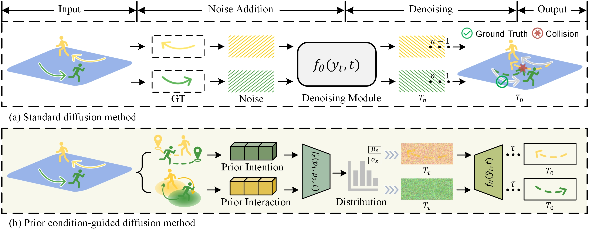

# CGD-TraP: Prior Condition-Guided Diffusion for Multi-Modal Pedestrian Trajectory Prediction

Official PyTorch implementation of  
**"Condition-Guided Diffusion for Multi-Modal Pedestrian Trajectory Prediction Incorporating Intention and Interaction Priors"** 

## 1. Overview
<p align="center">
  
</p>

**Abstract**. Pedestrian behavior exhibits inherent multi-modality, necessitating predictions that balance accuracy and diversity to adapt effectively to various complex scenarios. However, conventional noise addition in diffusion models is often aimless and unguided, leading to redundant noise reduction steps and the generation of uncontrollable samples. To address these issues, we propose a Prior Condition-Guided Diffusion Model (CGD-TraP) for multi-modal pedestrian trajectory prediction. Instead of directly adding Gaussian noise to trajectories at each timestep during the forward process, our approach leverages internal intention and external interaction to guide noise estimation. Specifically, we design two specialized modules to extract and aggregate intention and interaction features. These features are then adaptively fused through a spatial-temporal fusion based on selective state space, which estimates a controllable noisy trajectory distribution. By optimizing the noise addition process in a more controlled and efficient manner, our method ensures that the denoising process is effectively guided, resulting in predictions that are both accurate and diverse. 

## 2. Environment
### System Requirements
- Python 3.10+
- CUDA 11.3+
- PyTorch 1.12+
- 24GB+ GPU memory recommended

### Dependencies Installation
We recommend creating a new conda environment:
```bash
# Create and activate conda environment
conda create -n CGD-TraP python=3.10
conda activate CGD-TraP  
# Install PyTorch  
pip install torch==1.12.0
# Install Mamba
mamba_ssm==1.1.1
causal-conv==1.1.0
# Install other dependencies
pip install omegaconf numpy matplotlib scipy tqdm  
```

## 3. Data Preparation
**ETH-UCY.** The raw data is referenced from [Social-GAN](https://github.com/agrimgupta92/sgan);

**SDD.** The dataset is referenced from [PECNet](https://github.com/HarshayuGirase/Human-Path-Prediction/tree/master);

**NBA.** We use the same data and train-test splits provided by the previous SOTA model [LED](https://github.com/MediaBrain-SJTU/LED/tree/main);


## 4. Training&Evaluation
- Train on Stanford Drone Dataset (SDD)  
`python main.py --data_path './datasets' --mode 'train' --cfg ./configs/sdd.yml --manual_seed 0`

- Evaluation on Stanford Drone Dataset (SDD)  
`python evaluation.py --data_path './datasets' --mode 'test' --cfg ./configs/sdd.yml --model_ckpt ./checkpoints/SDD/model_opt --manual_seed 0`  

## 5. Acknowledgement
The code borrows from [LED](https://github.com/MediaBrain-SJTU/LED/tree/main), [PECNet](https://github.com/HarshayuGirase/Human-Path-Prediction/tree/master), [STGAT](https://github.com/huang-xx/STGAT), and data preprocessing part referring to [Social-GAN](https://github.com/agrimgupta92/sgan) and [LED](https://github.com/MediaBrain-SJTU/LED/tree/main). If you find this code useful in your research then please also cite their paper.
